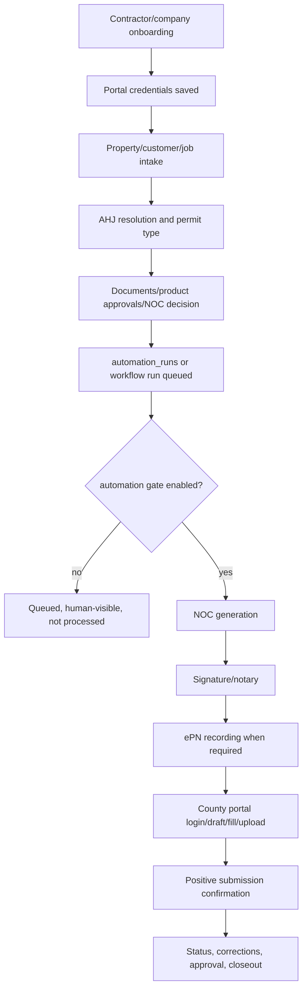

# DART iQ Agent Instructions

These instructions apply to all AI coding agents working in this repository. Follow the nearest scoped Cursor rule as well, but treat this file as the source of truth when rules overlap.

## 1. Repository Purpose

DART iQ is a multi-tenant roofing permit automation SaaS platform for contractors, operators, and administrators. It manages contractor onboarding, permit jobs, AHJ portal credentials, generated permit documents, NOC workflows, notarization/e-recording flows, AHJ portal automation, status tracking, and operational dashboards.

Correctness matters because the system interacts with live customer tenants, external government permitting portals, legal documents, billing-sensitive workflows, and production Supabase/Railway services. Treat permit portal automation, credential handling, tenant isolation, workflow recovery, and generated documents as production-sensitive even when you are only changing local code.

## 2. Repository Map

- `app/`: Next.js App Router UI and API routes. Owns admin, contractor, public tracking, auth, and webhook HTTP surfaces. Do not put long-running Playwright work here.
- `components/`: Shared React layout/widgets such as admin/contractor shells and the contractor chat widget. Do not place server-only secrets or service-role code in client components.
- `lib/`: Shared server/domain modules. Important areas include `lib/auth/`, `lib/workflow/`, `lib/automation/`, `lib/credentials/`, `lib/crypto/`, `lib/noc/`, `lib/documents/`, `lib/proof/`, `lib/epn/`, `lib/erecord/`, `lib/docusign/`, `lib/monitoring/`, and Supabase clients.
- `automation/`: Playwright AHJ portal runners, shared runner scaffolds, AHJ configs, and diagnostics. `automation/ahjs/configs/` owns county/provider mappings. Do not run diagnostics that contact live portals unless explicitly requested.
- `worker/`: Railway worker services. `index.js` handles permit portal run types, `noc-proof-erecord-worker.js` handles NOC/Proof/ePN run types, and `ops-worker.js` handles ops run types and scheduled ops tasks.
- `trigger/`: Trigger.dev task wrappers and orchestration. Playwright stays on Railway; Trigger tasks should enqueue or orchestrate work, not run browsers.
- `workflows/`: Durable workflow definitions and step implementations. `workflows/permit-workflow.js` defines the 16-step permit workflow.
- `supabase/migrations/`: Historical SQL migration files. Agents may author and apply migrations against staging; production SQL is reviewed and executed manually by Logan.
- `scripts/`: Development, diagnostic, seed, validation, and ops scripts. Treat one-off repair/backfill/diagnostic scripts as human-review surfaces.
- `marketing/`: Separate static marketing deployment config.
- `.github/workflows/`: CI/staging workflow definitions.
- `templates/` and document-related assets: legal/government document templates. Human review is required for changes.

## 3. Architectural Principles

- Tenant isolation is company-scoped. The verified tenant key is `company_id`.
- Contractor-facing queries must use or inherit verified `company_id` scope from `lib/auth/session.js`; never trust a client-supplied `company_id` by itself.
- Browser Supabase access uses `lib/supabase.js` with anon credentials. Server, admin, worker, and automation paths may use service role only with explicit auth and tenant checks.
- Keep UI rendering, domain logic, database access, and automation orchestration separated. Do not bury workflow or billing rules in React components when a `lib/` service exists.
- Jurisdiction behavior is configuration-driven through `ahj_portals` plus `automation/ahjs/configs/*`. Reusable portal-engine behavior belongs in shared runner modules; county-specific selectors and mappings belong in config/runner files.
- Background work must be idempotent, checkpointed where supported, and safe to retry. Check for existing permits, confirmations, receipts, saved drafts, workflow activities, and prior run state before irreversible work.
- Explicit state transitions are preferred over implicit side effects. Do not mark a permit, NOC, recording, or workflow complete because a click or API call merely succeeded.
- Preserve auditability. Use existing audit/logging helpers and sanitize logs.
- Prefer staging-first validation and backward-compatible workflow/database changes.

Sources of truth:

- Permit job status: `jobs` rows and related status fields.
- Workflow state: `lib/workflow/` state tables such as `workflow_runs`, `workflow_steps`, history/retry/failure/activity/event/artifact tables referenced by code.
- Legacy queue state: `automation_runs` and `automation_logs`.
- Billing/subscription status: company/subscription fields and Stripe-related configuration in the existing app/API code.
- Customer ownership and tenant scope: `users.company_id`, `companies`, and `jobs.company_id`.
- Portal credentials: `company_credentials` vault first, then legacy `company_ahj_credentials` fallback through credential services only.
- Jurisdiction configuration: `ahj_portals` plus `automation/ahjs/configs/*`.
- Automation enablement: `platform_settings.key = 'automation_enabled'` read by `lib/automation/automation-gate.js`.
- Generated documents: Supabase Storage paths and document metadata owned by document/NOC modules.

## 4. Coding Standards

- This repo is JavaScript-first with limited TypeScript. Preserve the local module style: App Router/API files mostly use ESM, while many `lib/`, `worker/`, `automation/`, and `workflows/` modules use CommonJS.
- Keep changes small and reviewable. Do not perform unrelated refactors.
- Do not use `any` in TypeScript unless unavoidable and explained.
- Do not silently catch errors. Log sanitized context and either return a deliberate error response or rethrow.
- Do not log secrets, portal credentials, tokens, signed URLs, full PII payloads, complete document contents, or raw production data.
- Do not introduce a dependency when an existing package or local helper solves the problem.
- Preserve public interfaces unless the task explicitly requires a breaking change.
- Prefer existing helpers in `lib/auth/session.js`, `lib/workflow/`, `lib/automation/`, `lib/credentials/`, and `lib/monitoring/`.
- Validate request bodies and route params before database writes.
- Async workers must avoid duplicate processing and must update run state consistently on success/failure.
- Comments should explain non-obvious workflow, security, or portal behavior; avoid restating simple code.

## 5. Supabase and PostgreSQL Conventions

Database execution policy:

- Agents may freely write and apply migrations against staging (`trimwcwzimfgzgimfwby`) for testing.
- Agents must never run migration commands or raw SQL against production (`yhxzwjoouiurxrmhjslg`) without Logan's explicit review and go-ahead.
- Before assuming a migration needs to run, check `supabase migration list`; schema may already be live even when migration tracking differs.
- Production migrations are reviewed and executed manually by Logan.

Repository conventions:

- Use timestamped migration filenames under `supabase/migrations/`; do not rewrite historical migrations that may already have run.
- New tenant-owned objects need RLS policies before production use. Never disable RLS as a shortcut.
- Never expose `SUPABASE_SERVICE_ROLE_KEY` to browser code.
- Never rely only on frontend filtering for tenant isolation.
- Every tenant-owned query must include or inherit verified `company_id` scope.
- Destructive schema changes require explicit human review and a rollout/rollback plan before the founder runs SQL.
- Evaluate indexes for new foreign keys and common query paths.
- Regenerate/update database types if schema changes require it.
- Keep storage access mediated by authenticated API/service code; do not expose raw sensitive paths.

Known database notes: checked-in migrations explicitly define only part of the live schema. Some workflow and gate tables are referenced by code but not represented in current migrations.

## 6. Playwright and AHJ Portal Automation Standards

- Every worker-side processing path must respect `lib/automation/automation-gate.js`. Never add a worker path that claims or processes jobs while the gate is off. Never change the gate to default ON or weaken its fail-closed behavior.
- Current session persistence uses `lib/automation/session-store.js` with Supabase Storage `job-documents/sessions/{provider}-{companyId}.json`. Known providers include `polk_accela`, `lee_accela`, `proof`, and `epn`.
- Retrieve credentials through `lib/credentials/secure-credential-service.js` or `lib/credentials/credential-loader.js`; do not read/decrypt credentials in client code.
- Prefer stable semantic selectors, labels, roles, names, and validated config selectors. Avoid arbitrary sleeps unless no event-based alternative exists and the reason is documented.
- Never bypass CAPTCHA, MFA, rate limits, access controls, or portal security controls.
- Never submit a permit, e-recording, notarization, signature packet, or payment twice because a previous response was ambiguous.
- Before retrying an irreversible action, check for existing permit numbers, confirmation numbers, receipts, saved drafts, submitted packages, or workflow events.
- Capture sanitized evidence that helps operators diagnose failures without exposing credentials or unnecessary PII.
- Treat changed selectors and portal layout changes as normal operational failures. Do not weaken validation to get past them.
- Use explicit checkpoints before irreversible actions and positive confirmation before marking jobs/workflows submitted or complete.
- Preserve human operator resume/intervention paths.
- Keep transport separation: Playwright is current, but a planned `workflow_type = 'api'` Accela Construct/V4-style adapter is not implemented in this repo. Do not hard-code Playwright-only assumptions into shared job/workflow interfaces.

Important paths: `automation/ahjs/polk-county.runner.js`, `automation/ahjs/lee-county.runner.js`, `automation/ahjs/shared/*`, `automation/ahjs/configs/*`, `worker/runner.js`, `automation/runner.js`, `lib/automation/session-store.js`, `lib/automation/automation-gate.js`, `lib/epn/epn-session.js`, and `lib/proof/proof-session.js`.

## 7. Railway and Deployment Rules

Railway surfaces found in the repo:

- Root web service: `railway.json`, health check `/api/health`, start command from `package.json` is `npm run start`.
- Permit worker: `worker/railway.json`, Dockerfile `worker/Dockerfile`, entry `worker/index.js`.
- NOC/Proof/ePN worker: `worker/railway.noc-proof-erecord.json`, Dockerfile `worker/Dockerfile.noc-proof-erecord`, entry copied to `node index.js`.
- Ops worker: `worker/railway.ops.json`, Dockerfile `worker/Dockerfile.ops`, entry `worker/ops-worker.js`.
- Marketing site: `marketing/railway.json`, Nixpacks, health check `/health.json`.

Rules:

- Never rename, delete, merge, or repurpose a Railway service automatically.
- Never change production Railway environment variables automatically.
- Never point staging services at the production database.
- Never deploy, replay, or trigger production Trigger.dev tasks as part of agent work.
- Trigger.dev (`trigger.config.mjs`, `trigger/`) is orchestration/control plane; Playwright/browser work belongs on Railway workers.
- Validate service-specific builds where relevant. A root `npm run build` does not prove the worker Docker images build.
- Keep web processes and long-running worker processes separated.
- Document env var changes in `.env.staging.example`, `.env.production.example`, and the final response. Do not commit real values.
- ePN browser flows are memory-sensitive; `lib/epn/epn-session.js` and diagnostic scripts contain container memory evidence. Treat ePN infrastructure changes carefully.

## 8. DART iQ Permit Lifecycle

Implemented durable permit workflow from `workflows/permit-workflow.js`:

1. `extract_documents`
2. `validate_documents`
3. `generate_noc` (`noc_generate`)
4. `request_signature` (`proof_send`)
5. `wait_signature` (`SignatureCompleted`)
6. `start_notary`
7. `wait_notary` (`NotaryCompleted`)
8. `submit_epn` (`erecord_submit`)
9. `wait_recording` (`RecordingFinished`)
10. `county_login` (`permit_phase_1`)
11. `county_fill_forms` (`permit_resume`)
12. `county_upload` (`permit_resume`)
13. `county_submit` (`permit_submit`)
14. `wait_county` (`CountySubmissionCompleted`)
15. `notify_customer`
16. `complete_permit`

Current production path still uses legacy `automation_runs` polling unless durable workflow flags/start paths opt in. Jobs may be created and submitted to the queue while the automation gate is off; workers must not process them until the founder enables `platform_settings.automation_enabled`.

Typical flow:

Human intervention points include onboarding approval, credential issues, Proof/notary completion, ePN review/recording failures, portal CAPTCHA/MFA/layout changes, ambiguous submissions, corrections, and admin workflow overrides.

Partially implemented/planned areas: Trigger tasks include stubs; notification/notary/county durable phases may not all be production-complete; the planned API transport for Accela is not implemented; the contractor chat widget exists but is non-functional without server-side `ANTHROPIC_API_KEY`.

## 9. Protected and Human-Review-Only Areas

Never modify automatically:

- Real `.env*` files, production secrets, encryption keys, token values, or credential material.
- Persisted browser sessions, including `job-documents/sessions/*`, `automation/sessions/`, `tmp/**/storageState*.json`, and equivalent local state files.
- Production Supabase data or production SQL execution paths.
- `platform_settings.automation_enabled` live value, the automation gate default OFF/fail-closed semantics, or any bypass of `isAutomationEnabled()`.
- Trigger.dev production task triggering, replay, deployment, or run mutation.
- Production Railway variables, service identities, domains, or database connection settings.
- Generated production permit documents, audit logs, production data, and customer PII.

Human review required:

- `lib/crypto/credential-encryption.js`, `lib/credentials/*`, auth/authorization code, RLS policies, service-role access, signed URL handling.
- `app/api/contractor/chat/route.js` and any `ANTHROPIC_API_KEY` handling; secrets must remain server-side.
- Stripe/payment/billing calculations or finance portals.
- `worker/*`, `lib/workflow/*`, `workflows/*`, `trigger/*`, and `automation_runs` retry/checkpoint/finalization behavior.
- Permit submission finalization, e-recording submission, notarization, Proof, DocuSign, and customer notification logic.
- Legal/government templates, including NOC templates and forms in `templates/` or storage-backed document template paths.
- Historical migrations, destructive scripts, backfills, repair scripts, and company deletion paths.

Safe to modify with tests:

- Low-risk UI copy/layout that does not affect auth, tenant scope, billing, legal documents, or workflow state.
- Pure utility functions with focused tests.
- Documentation and scoped agent rules when they reflect verified repo behavior.
- Non-production examples/placeholders that do not contain secrets.

Do not resurrect the deliberately removed contractor materials system. Historical references may remain, but do not add `company_materials` UI or docs as active product behavior.

## 10. Required Change Workflow

For every coding task:

1. Read this file and the nearest `.cursor/rules/*.mdc` rule.
2. Inspect related code, migrations, env templates, tests, and deployment surfaces.
3. Identify affected services, database objects, tenants, workflows, and external systems.
4. State assumptions instead of silently guessing.
5. Make the smallest coherent change.
6. Add or update tests when behavior changes.
7. Run relevant validation commands that are safe for the change.
8. Review the diff for secrets, tenant leaks, destructive behavior, automation-gate bypasses, live SQL execution, weakened security, and unrelated changes.
9. Document SQL for founder execution, env vars, deployment ordering, manual steps, and unresolved risk.

Do not run tests or scripts that could submit permits, contact live government portals, send customer messages, create charges, notarize/e-record documents, process queued jobs, mutate live data, or trigger production workflows.

## 11. Definition of Done

A change is complete only when the relevant subset is true:

- `npm run lint` passes or existing unrelated lint debt is documented.
- `npm run test:unit` passes or lack/failure of tracked tests is documented.
- `npm run build` passes for web-impacting changes. The production-equivalent web build (`npm run build`) is enforced by the GitHub Actions `build` job on PRs/pushes to `main` (ZIG-15); do not treat a green unit-test job alone as sufficient for web routes/components. A root `npm run build` still does not validate worker Docker images.
- Worker-impacting changes have appropriate static checks and, when practical, Docker/service-specific build validation.
- `node --check` is run on changed CommonJS worker/automation files where no better test exists.
- AHJ config changes run `node -e "require('./automation/ahjs/config-validator.js').validateAllConfigs()"`.
- Schema changes may be validated against staging; production SQL is reviewed and executed manually by Logan.
- RLS and tenant isolation are evaluated for database changes.
- Automation gate state and semantics are unchanged unless the founder explicitly requested otherwise.
- No secrets or production data are committed.
- Environment variable changes are reflected in both env example files.
- Railway/Trigger service impact and rollout order are documented.
- Irreversible actions and retry/error behavior have been evaluated.
- Remaining risks are listed honestly.
